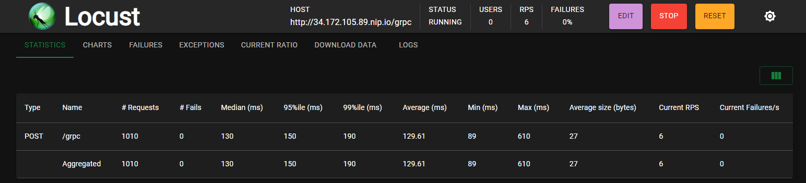
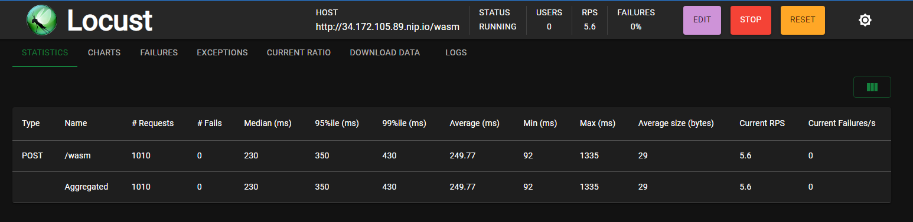
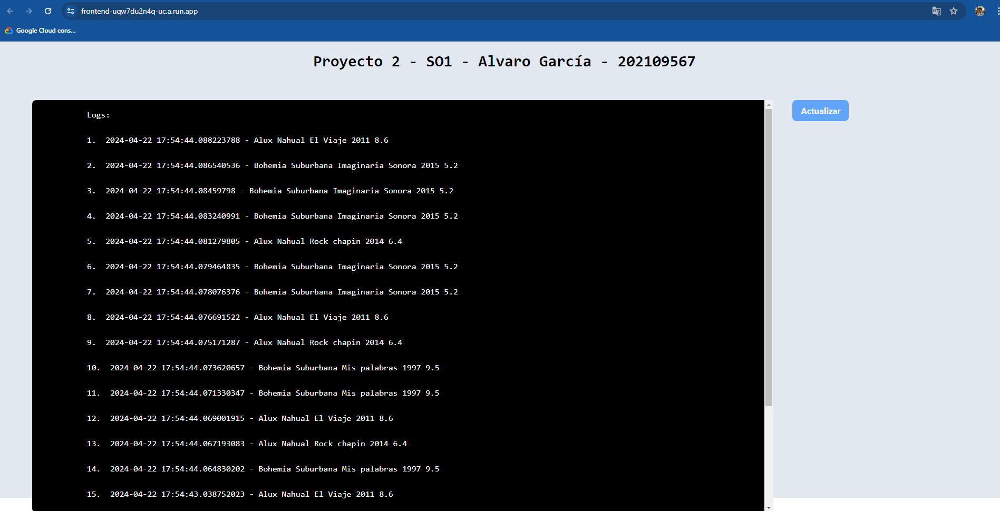
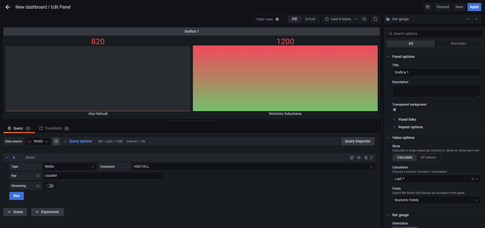
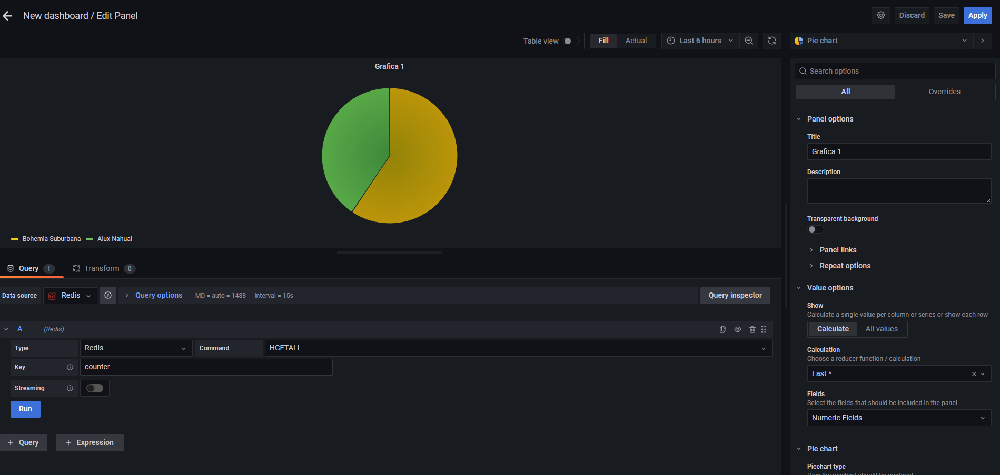

# Proyecto 2 - Alvaro Norberto García Meza - 202109567
# Documentación

## Introducción
Este proyecto implementa un sistema de votaciones para un concurso de bandas musicales guatemaltecas utilizando una arquitectura de microservicios desplegada en un clúster de Kubernetes. El objetivo es enviar tráfico simulado a través de diferentes servicios, que incluyen productores y consumidores, para procesar y almacenar los datos generados por las votaciones.

Los productores, desarrollados con gRPC y Wasm, envían datos a un sistema de mensajería basado en Kafka, que actúa como intermediario para la comunicación asincrónica. Los consumidores, programados en Golang, procesan las peticiones de Kafka y almacenan la información en bases de datos Redis y MongoDB. Redis se usa para contar las votaciones en tiempo real, mientras que MongoDB guarda los registros o logs del sistema.

Para visualizar los datos, se utiliza Grafana para crear dashboards que muestren métricas en tiempo real. Además, el proyecto incluye una API en Node.js y una aplicación web en Vue.js desplegadas en Google Cloud Run para interactuar con el sistema y mostrar información almacenada en MongoDB.

## Objetivos
- Implementar un sistema distribuido con microservicios en Kubernetes.
- Encolar distintos servicios con sistema de mensajería Kafka.
- Utilizar Grafana como interfaz para visualizar métricas en tiempo real.

## Descripción de cada tecnología

### Kubernetes
Kubernetes es una plataforma de código abierto para automatizar la implementación, escalado y gestión de aplicaciones en contenedores. En este proyecto, se utiliza un clúster de Kubernetes alojado en Google Cloud para implementar microservicios y gestionar la comunicación entre ellos. Se incluye un servidor Kafka, productores y consumidores de datos, así como bases de datos y otros servicios necesarios para el sistema de votación.

### Locust
Locust es una herramienta para generar tráfico y realizar pruebas de carga en aplicaciones. En este proyecto, se utiliza para enviar datos a diferentes servidores desplegados en Kubernetes, simulando el tráfico generado por las votaciones. Está desarrollado en Python y se ejecuta localmente para generar el tráfico necesario.

### Cliente - Servidor (Wasm + RUST)
Se implementa una arquitectura cliente servidor, donde el cliente escrito en Rust y compilado a WASM actua como el receptor del trafico del exterior y lo envia al servidor escrito en Rust que se encarga de producir los mensajes a Kafka.

### Cliente - servidor (gRPC + Golang)
Se implementa una arquitectura cliente servidor, donde el cliente escrito en Golang actua como el receptor del trafico del exterior y lo envia al servidor usando el protocolo gRPC escrito en Golang que se encarga de producir los mensajes a Kafka.

### Kafka (con strimzi)
Kafka es una plataforma de mensajería distribuida que permite el envío y recepción de mensajes de forma asincrónica. En este proyecto, se utiliza Kafka para encolar los datos generados por los productores y consumirlos en los servicios correspondientes. Strimzi es un operador de Kubernetes que facilita la implementación y gestión de Kafka en un clúster de Kubernetes.

### Consumidor (Golang)
El consumidor es un servicio que recibe los mensajes de Kafka y los procesa para almacenarlos en bases de datos. En este proyecto, se implementa un consumidor en Golang que recibe los datos de votaciones y los almacena en bases de datos Redis y MongoDB.

### Redis
Redis es una base de datos en memoria, rápida y con capacidad para almacenar datos clave-valor. En este proyecto, se utiliza para guardar contadores y otras métricas en tiempo real generadas por el consumidor Golang.

### MongoDB
MongoDB es una base de datos NoSQL que permite almacenar documentos en formato JSON. Se utiliza para guardar logs generados por los diferentes servicios del sistema de votaciones. Los datos almacenados en MongoDB se pueden consultar a través de una aplicación web.
### Grafana
Grafana es una herramienta para crear dashboards y visualizar datos en tiempo real. En el proyecto, Grafana se conecta a Redis para mostrar gráficos y métricas relacionadas con el sistema de votaciones. Esto permite observar el flujo de votaciones en tiempo real y otras estadísticas importantes para el proyecto.

### Cloud Run (GCP)
Cloud Run es una plataforma para ejecutar aplicaciones en contenedores en Google Cloud. Aquí, se utiliza para desplegar una API en Node.js y una aplicación web en Vue.js. La API permite interactuar con el sistema de votaciones, y la aplicación web muestra los últimos registros de MongoDB en forma de terminal para facilitar la visualización de logs y otros datos.

## Descripción de ada deployment y service de K8S

### namespace.yaml

Este archivo tiene un namespace llamado `so1-proyecto2` para poder tener un espacio de nombres para las bases de datos y
poder tener un mejor control de los recursos que se van a utilizar.

```bash
kubectl apply -f namespace.yaml # deploy namespace
```


### mongo.yaml

Este archivo tiene un deployment de mongo con un servicio de tipo LoadBalancer para poder acceder a la base de datos desde afuera del cluster o bien usando el nombre del servicio como DNS.

```bash
kubectl apply -f mongo.yaml # deploy mongo pod
```

### redis.yaml

Este archivo tiene un deployment de redis con un servicio de tipo LoadBalancer para poder acceder a la base de datos desde afuera del cluster o bien usando el nombre del servicio como DNS.

```bash
kubectl apply -f redis.yaml # deploy redis pod
```

### grcp.yaml
Es un deployemnt que cuenta con un pod con dos contenedores, un cliente el cual es un servicio en golang que recibe data desde el exterior y que la procesa para mandar en gRCP al servidor que es un servicio escrito en golang que recibe la data y produce un evento a kafka.

Cuenta con un servicio que de tipo ClusterIP para poder acceder al pod desde el cluster usando un Ingress.

```bash
kubectl apply -f grpc.yaml # deploy grpc pod
```

### wasm.yaml

Es un deployemnt de un pod con un servicio escrito en Rust compilado en WASMEDGE que recibe data desde el exterior y que produce un evento a kafka.

Cuenta con un servicio que de tipo ClusterIP para poder acceder al pod desde el cluster usando un Ingress.

```bash
kubectl apply -f wasm.yaml # deploy wasm pod
```


### consumer.yaml

Es un deployemnt de un pod con un servicio escrito en golang que consume los eventos de kafka y los guarda en la base de datos de mongo y redis

```bash
kubectl apply -f consumer.yaml # deploy consumer pod
```


### ingress.yaml

Para el ingres se necesita un controlador de ingres, en este caso se utilizo el controlador de ingress de NGINX usando Helm.
  
  ```bash
kubectl create ns nginx-ingress
helm repo add ingress-nginx https://kubernetes.github.io/ingress-nginx 
helm repo update 
helm install nginx-ingress ingress-nginx/ingress-nginx -n nginx-ingress
kubectl get services -n nginx-ingress # (To get the Load Balancer IP Address)
  ```

Obtener la IP Externa del Load Balancer y agregarla al archivo `ingress.yaml` en la sección `spec.rules.host` para poder acceder a los servicios desde afuera del cluster.

Luego se aplica el archivo `ingress.yaml` para poder acceder a los servicios desde afuera del cluster.
```bash
kubectl apply -f ingress.yaml # deploy ingress
```

### Kafka

Comandos para crear los pods de kafka usando Strimzi
  
  ```bash
  kubectl create -f 'https://strimzi.io/install/latest?namespace=so1-proyecto2' -n so1-proyecto2
  kubectl get pod -n so1-proyecto2 --watch

  kubectl apply -f https://strimzi.io/examples/latest/kafka/kafka-persistent-single.yaml -n so1-proyecto2

  kubectl get pod -n so1-proyecto2
  ```
## Ejemplo de funcionamiento con capturas de pantalla
#### Injección de tráfico con Locust al servicio gRPC


#### Injección de tráfico con Locust al servicio Wasm


#### Logs de los valores de las votaciones en MongoDB


#### Grafana mostrando las métricas de Redis



## Conclusiones

- Al inyectar a cada servicio un trafico de 1010 peticiones con una cantidad 4 usuarios, se determino que el servicio de gRPC fue el que menos se tardó. Fue casi el doble de rápido que el servicio de WASM, eso se debió a que el servicio hecho en Rust utilizo en su totalidad HTTP en comparación al servicio hecho en golang que utilizó gRPC para comunicar la información entre el cliente y el servidor.  Se sabe que gRPC es mucho más rápido, eficiente y ligero que el protocolo de HTTP por la forma en como serializa la información y que las funciones a ejecutar se realizan en el servidor y solo retorna la respuesta.
  
- WASM es una herramienta que se utilizaría en ámbitos donde los recursos son muy limitados, donde el ancho de banda y los recursos de hardware son escasos. gRPC es una buena herramienta para mantener sistemas distribuidos y cuando se necesita ser lo más eficiente.

- El uso de Kubernetes para crear sistemas distribuidos, donde múltiples tecnologías puedan convivir y compartir información es una excelente opción para tener el control de todo y crear arquitecturas escalables, automatizadas y seguras.