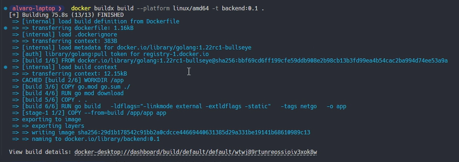
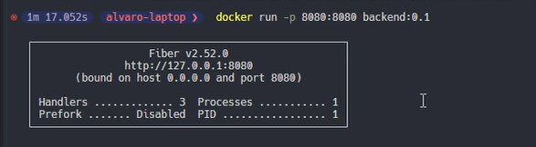
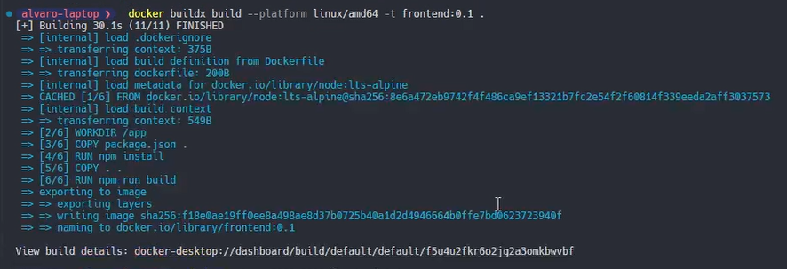
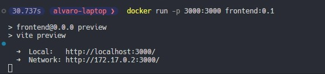
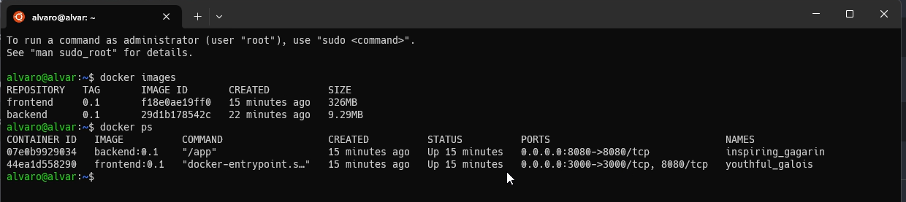

# Tarea 1 

## [Video explicación](https://drive.google.com/file/d/148uT_pbr-EiDw-iG5SfkX9ESFEx_fWhn/view?usp=drive_link)

# Backend

### Comando para crear la imagen de docker
```
 docker buildx build --platform linux/amd64 -t backend:0.1 . 
```

### Comando para correr el contenedor
```
 docker run -p 8080:8080 backend:0.1
```


# Frontend

### Comando para crear la imagen de docker
```
 docker buildx build --platform linux/amd64 -t frontend:0.1 . 
```

### Comando para correr el contenedor
```
 docker run -p 3000:3000 frontend:0.1
```


### Imagenes y contenedores corriendo
